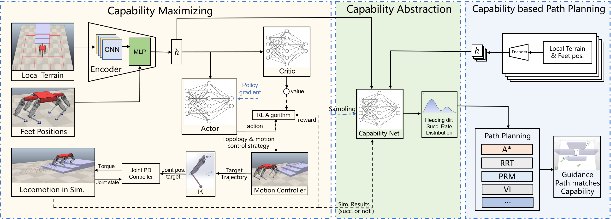

The capability of a legged robot varies in line with its structure, topology, and locomotion controller. With different capability, legged robots can walk past terrains of varying complexity. However, existing legged robots' motion controllers and path planners neither consider how to maximize the robot's capability according to the current environment, nor give a global guidance path that meets the robot's capability. In this letter, we propose a hierarchical learning based motion control and planning system for legged robots. It consists of three parts: capability maximizing, capability abstraction and capability based path planning. Capability maximizing uses reinforcement learning to choose best control strategy and robot topology which maximizes the robot's traverse capability; capability abstraction network gives the robot's capability under current terrain and footholds state; capability based path planning gives long-range guidance path that conforms our robots traverse capability learned by capability abstraction network. We trained our framework in simulation and did long-range locomotion experiments both in simulation and real world on our hexapod robot Qingzhui. The results shows that our method greatly improves the global locomotion performance of our legged robot.

### System Framework

> The overall control diagram, layered learning framework and global path planning method. Terrain-map and footholds' information are encoded to a vector h in hidden space, which serves as input of low level capability maximizing networks and high level capability abstraction network. Reinforcement learning is used for the low level layer. The actor outputs an action consists of best topology and motion control strategy in current state. The locomotion task is conducted by the chosen motion controller that generate torso and feet trajectories. Then IK module and joint PD controller accomplish these trajectories in simulation. The locomotion result in simulation constitutes the reward to train the low level networks. The high level capability abstraction network is trained by using supervised learning method. Locomotion samples are generated with the trained low level layer in simulation. Finally, We apply our Capability model to classic path planning algorithms to improve their performance.

