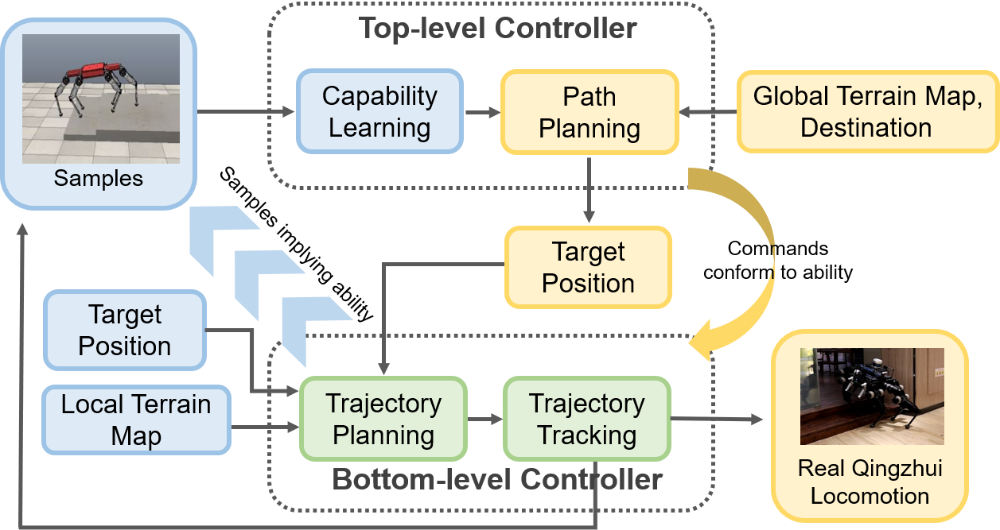

We present CapPlanner, a hierarchical motion control and planning system which can do long-range locomotion control and planning according to the learned traverse capability of the robot in different topologies. It consists of two layers, the bottom-level controller computes the trajectory of the body and the feet according to the terrain, local target and current feets’ positions. Besides, it controls the motors to track the calculated trajectory.
The top-level controller learns the traverse ability of the robot with its bottom-level controller by simulating locomotion tasks on various terrains and in different topologies. Hence our CapPlanner can guide the robot to reach a long-term destination with a much higher success rate.

### System Framework

> Overall framework of CapPlanner. TLC learns the traverse ability of BLC-robot system and give commands that conform to BLC-robot system. The blue elements run in simulation, the yellow elements run in reality, and the green elements run in both simulation and reality.

[Download paper here](http://lonelyfluency.github.io/files/capplanner.pdf)
