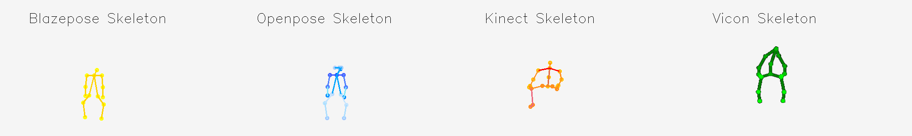
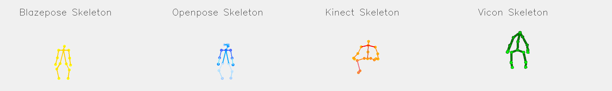
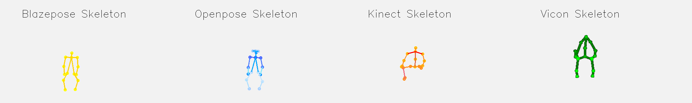
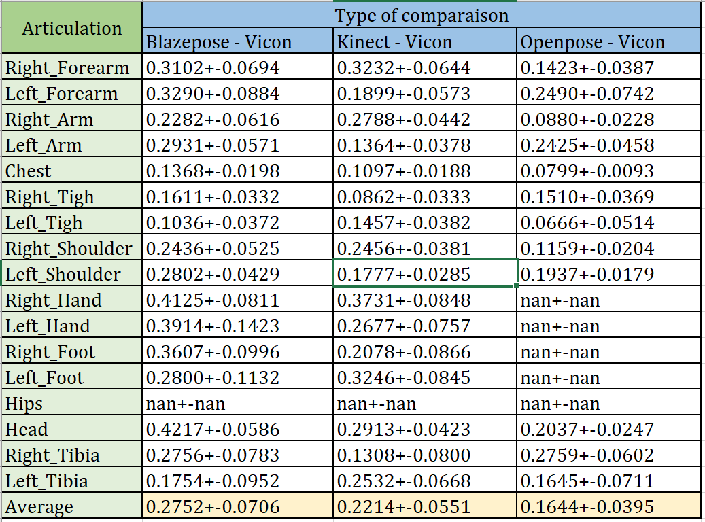
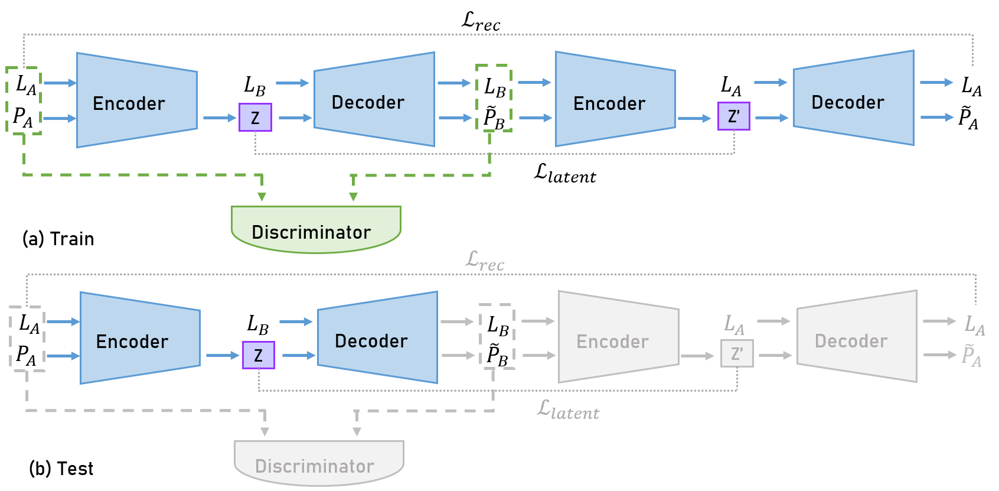
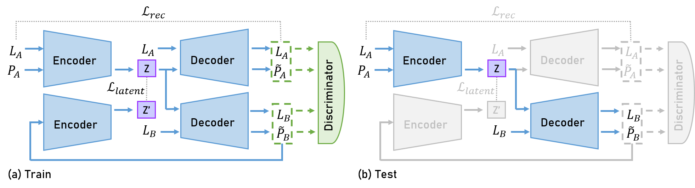

The Keraal project aims to develop a physiotherapist robot called Poppy capable of “coaching” patients during their rehabilitation sessions. Our work is a part of the Keraal project to improve the capability of the Poppy robot. The objective of our work is to detect and imitate human movements by the Poppy robot. Firstly, we try the Blazepose library to detect human skeletons in the collected videos, and we compare the results with those made by the Kinect, Openpose and Vicon library and calculate the differences. We choose the Kinect library as the most suitable library for imitation work. After obtaining the human motions, we build a learning model to apply motion retargeting between two characters. We test the model on animation data from Mixamo, then analyze the performance and propose a method to improve. 

## Movement detection and comparison

> The skeleton detected by Blazepose, Openpose, Kinect and Vicon.

> The comparison of error between Blazepose-Vicon, Openpose-Vicon and Kinect-Vicon 

## Motion retargeting

> The architecture of two networks

## Video Presentation
<figure class="video_container">
  <video controls="true" allowfullscreen="true" poster="path/to/video.png">
    <source src="../files/Trailer_ProjetKERAAL_STF.mp4" type="video/mp4">
  </video>
</figure>

<!-- <figure class="video_container">
  <iframe src="https://GuoyuloveSunshine.github.io/files/Trailer_ProjetKERAAL_STF.mp4" frameborder="0" allowfullscreen="true"> </iframe>
</figure> -->

## Files download
You can download the [report](http://GuoyuloveSunshine.github.io/files/PRe.pdf) of this project, and the [poster](http://GuoyuloveSunshine.github.io/files/Poster.pdf) of this project.
