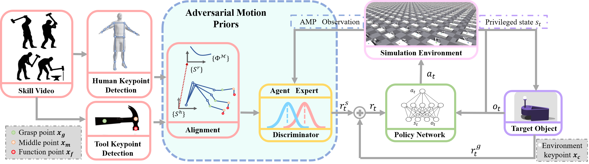
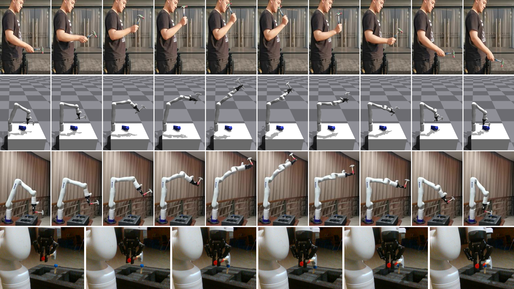

In recent years, there has been growing interest in developing robots and autonomous systems that can interact with humans in a more natural and intuitive way. One of the key challenges in achieving this goal is to enable these systems to manipulate objects and tools in a manner that is similar to how humans do. In this paper, we propose a novel approach for learning human-style manipulation skills by using adversarial motion priors.

Our approach leverages a deep neural network to model the complex dynamics of tool and object manipulation. The network is trained using a combination of real-world data and synthetic data generated by an adversarial network. The adversarial network is designed to generate realistic motion trajectories that match the statistical properties of human motion, which are then used to augment the training data for the manipulation network.

We evaluate our approach on a set of challenging manipulation tasks, including hammering, clawing nails, and ball-throwing-catching. Our results demonstrate that our approach is able to learn human-style manipulation skills that outperform state-of-the-art methods on several benchmark datasets. Additionally, we show that our approach is able to generalize to novel objects and tasks, demonstrating its potential for real-world applications.

Overall, our approach represents a significant step towards developing robots and autonomous systems that can interact with humans in a more natural and intuitive way, by learning to manipulate tools and objects in a manner that is similar to how humans do.

### System Framework

> The overall structure of HMAMP. With human manipulation video clips, we extract the keypoints of human arm and manipulation tools. Then we do keypoints alignment between robot arm in simulation and real world human motion clips. The AMP Discriminator is to discriminate whether an action sequence is a real human expert motion or generated by the policy network. The AMP reward and task reward for manipulation task is added to be the total reward for RL training.

### Experiment Result

> Real robot arm experiment. The first row shows human knocking motion clips that we used as motion priors. The second row shows the policy HMAMP in simulation, the hammer can successfully complete the task with the manipulation trajectory that we desired. The third row shows the HMAMP implemented in real world, we choose Kinova Gen3 as the carrier, and the fourth row is the details about hammering a nail for real robot arm experiments.

### Videos

<figure class="video_container">
  <video controls="true" allowfullscreen="true" poster="../images/ziqi_video_front.jpg">
    <source src="../files/ziqi_video.mp4" type="video/mp4">
  </video>
</figure>